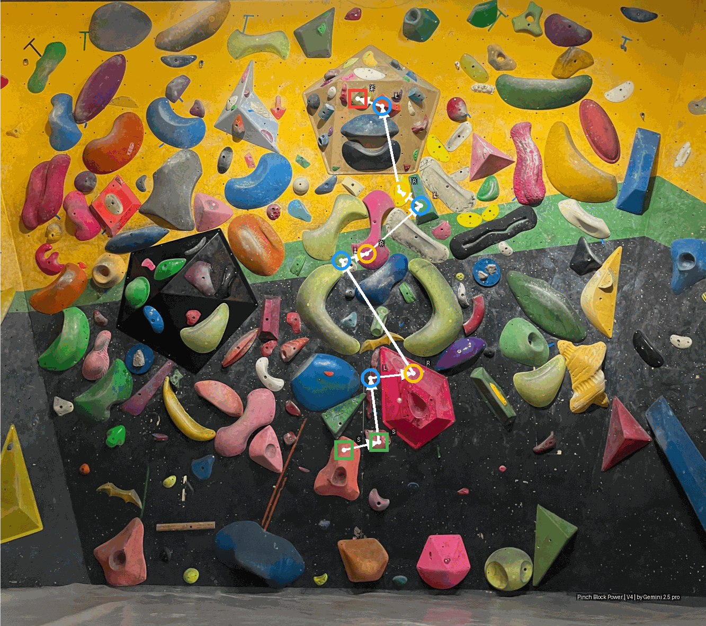

# 🧗‍♂️ 攀岩路线图自动生成器 (Automated Climbing Route Generator)

这是一个基于 GitHub Actions 的全自动攀岩路线图（Topo）生成系统。你只需要在一张攀岩墙的图片上标记出岩点，并在一个JSON文件中定义路线，系统就会自动为你绘制出所有精美的路线图、提交到仓库，并打包成一个ZIP文件方便下载。

## ✨ 核心功能

- **AI辅助定线**：可使用大语言模型（如ChatGPT, Copilot等）辅助创造路线，并直接生成标准JSON格式。
- **自动化**：只需修改路线定义文件并推送到 `main` 分支，所有图片的生成、压缩和提交过程将自动完成。
- **集中管理**：所有路线都定义在单一的 `routes/all_routes.json` 文件中，管理和维护极为方便。
- **智能识别**：自动从攀岩墙图片中识别岩点编号，并生成坐标文件。
- **交互式补充**：提供本地工具，通过简单的鼠标点击即可轻松补充未被自动识别的岩点。
- **精美绘图**：为每条路线生成带起止点、手点顺序、脚点、路线信息和动作流箭头的图片。
- **高效压缩**：生成的PNG图片经过优化和压缩，体积更小，加载更快。
- **方便下载**：所有生成的路线图会自动打包成一个 `.zip` 文件，作为工作流的产物(Artifact)，可一键下载。

## 🚀 工作流程 (How it Works)

本项目的核心是一个 GitHub Actions 工作流 (`.github/workflows/main.yml`)，当 `routes/all_routes.json` 文件或相关脚本被修改并推送到 `main` 分支时，该工作流会被自动触发。

整个流程如下：

1.  **岩点坐标生成 (`generate_coords.py`)**
    -   工作流首先会运行脚本，读取 `images/with_mark.png` 这张带有标记的攀岩墙图片。
    -   利用 `easyocr` 库识别图片上每个岩点的编号/字母。
    -   生成一份包含所有岩点ID及其(x, y)坐标的 `data/holds.json` 文件。这是后续所有绘图步骤的基础。

2.  **路线图绘制 (`draw_route.py`)**
    -   脚本读取 `routes/all_routes.json` 文件，获取所有路线的定义列表。
    -   对于列表中的**每一条路线**：
        -   在 `images/ori_image.png` (原始底图) 的副本上开始绘制。
        -   根据路线定义中的 `moves` 数组，查找 `data/holds.json` 中对应的手点坐标。
        -   使用不同颜色和形状的圆圈/方框标记出手点、起始点(S)和结束点(F)。
        -   在手点右上角标注清晰的文字（L/R/S/F/B）。
        -   如果定义了 `holds.foot`，则标记出指定的脚点。
        -   绘制箭头，清晰地指示出动作的顺序和方向。
        -   在图片左上角添加标题，包含路线名、难度和作者。
        -   将最终生成的图片进行**量化压缩**，以减小文件体积。
        -   以 `[难度]_[路线名称].png` 的格式 (例如 `V3_Polygon_Puzzle.png`) 保存到 `generated_routes/` 目录下。

3.  **自动提交 (`git-auto-commit-action`)**
    -   工作流会自动将新生成的 `data/holds.json` 文件和 `generated_routes/` 目录下的所有 `.png` 图片提交到你的GitHub仓库。
    -   提交信息为 `"feat(routes): 自动生成所有路线图"`。

4.  **打包与上传 (`zip` & `upload-artifact`)**
    -   将 `generated_routes/` 目录下的所有图片压缩成一个名为 `climbing_routes.zip` 的文件。
    -   将这个ZIP文件作为工作流的**产物 (Artifact)** 上传。

## 📖 如何使用

### 第0步 (可选): 使用AI辅助定线

你可以利用大语言模型（LLM）来激发灵感、设计路线，并让它直接生成符合我们系统要求的JSON代码。这比手动编写JSON要快得多。

将下面的模板复制到任何一个大语言模型（如ChatGPT, Copilot, 文心一言等），修改其中的粗体部分，然后运行即可。

#### 提示 (Prompt) 模板

```text
你是一名专业的攀岩定线员。请为我设计一条难度为 **V4** 的攀岩路线，风格偏向**动态和核心力量 (dynamic and core-intensive)**。
路线名称定为 **'Crimpy Concerto'**，作者是 **'ying-ge'**。

请遵循以下规则：
1. 起始点 (start) 应该有两个，左右手各一个。
2. 结束点 (finish) 应该是一个双手合并的点。
3. 路线的动作序列 (moves) 应该包含 5 到 8 个手点。
4. 你可以自由选择岩点ID (例如 '61', 'k', '128')。
5. 你可以为这条路线指定 3 个额外的脚点 (foot holds)。

最后，请**严格按照**以下JSON格式输出你的定线方案，不要添加任何额外的解释或文字，直接给出JSON代码块：

{
  "routeName": "路线名称",
  "difficulty": "难度",
  "author": "作者",
  "holds": {
    "foot": ["脚点1", "脚点2", "..."]
  },
  "moves": [
    { "hold_id": "岩点ID", "type": "start", "hand": "left" },
    { "hold_id": "岩点ID", "type": "start", "hand": "right" },
    { "hold_id": "岩点ID", "hand": "left" },
    { "hold_id": "岩点ID", "hand": "right" },
    { "hold_id": "岩点ID", "type": "finish", "hand": "both" }
  ]
}
```

### 第1步：添加或修改路线定义

将AI生成的JSON代码，或者你自己手动编写的路线，添加到 `routes/all_routes.json` 文件的 `routes` 数组中。

---

### 第2步：修正缺失的岩点 (本地工作流)

自动的岩点识别 (`generate_coords.py`) 非常方便，但它可能无法100%识别出图片上所有的岩点。当路线定义中使用了未被识别的岩点时，你需要手动补充它们的坐标。为了简化这个过程，我们提供了一个交互式坐标拾取工具：`add_missing_coords.py`。

**注意：** 以下步骤需要在你的**本地计算机**上完成，因为它需要一个图形界面。

1.  **安装依赖 (首次运行)**:
    确保你已经安装了 `opencv-python`。
    ```bash
    pip install opencv-python
    ```
2.  **运行自动识别**:
    首先，像往常一样运行自动识别脚本，让它完成大部分工作。
    ```bash
    python .github/scripts/generate_coords.py
    ```
3.  **运行交互式补充工具**:
    现在，运行新的 `add_missing_coords.py` 脚本来处理所有缺失的岩点。
    ```bash
    python .github/scripts/add_missing_coords.py
    ```
4.  **根据提示点击岩点**:
    -   脚本会自动分析出哪些在路线中被使用、但未被识别的岩点。
    -   一个图片窗口会弹出，上面有提示信息，例如 "Please CLICK on hold: '139'"。
    -   在该图片上找到 '139' 号岩点，并用鼠标左键**点击它的中心**。
    -   点击后，窗口会自动刷新，并提示你点击下一个缺失的岩点，直到全部处理完毕。

5.  **完成！**
    `data/holds.json` 文件现在已经包含了所有必需的岩点坐标。

---

### 第3步：提交并推送

将你修改过的 `routes/all_routes.json` 和 `data/holds.json` 文件提交并推送到 `main` 分支。
```bash
git add routes/all_routes.json data/holds.json
git commit -m "feat: 添加或更新路线"
git push
```
GitHub Actions 会接管剩下的一切。稍等片刻，你就可以在仓库的 `generated_routes/` 目录下看到新的路线图，或者在Actions的运行记录页面下载包含所有图片的ZIP压缩包。

## 📂 项目文件结构

```
.
├── .github/
│   ├── scripts/               # 存放所有Python脚本
│   │   ├── generate_coords.py   # 1. 自动识别岩点坐标
│   │   ├── add_missing_coords.py  # 2. (本地)交互式补充缺失坐标
│   │   ├── draw_route.py        # 3. 绘制路线图
│   │   ├── check_missing_holds.py # (检查用) 检查缺失的岩点
│   │   └── mark_all_holds.py    # (调试用) 标记所有岩点
│   └── workflows/
│       └── main.yml           # 核心工作流配置文件
├── data/
│   └── holds.json             # 岩点坐标数据 (部分自动生成，部分手动补充)
├── generated_routes/          # 自动生成的路线图存放处
│   ├── V0_Green_Highway.png
│   └── ...
├── images/
│   ├── ori_image.png          # 用于绘图的原始底图
│   └── with_markplus.png      # 用于OCR识别的带标记图片
├── routes/
│   └── all_routes.json        # 唯一需要你手动编辑的路线定义文件
└── README.md                  # 就是你正在看的这个文件
```

## 🎨 外观定制

想要修改路线图的样式（如颜色、大小、字体）？

所有样式都定义在 `.github/scripts/draw_route.py` 文件顶部的 `STYLE_CONFIG` 字典中。你可以直接修改里面的值来改变最终图片的视觉效果。

```python
# .github/scripts/draw_route.py

STYLE_CONFIG = {
    'start':       {'outline': (76, 175, 80, 255), ...},
    'finish':      {'outline': (244, 67, 54, 255), ...},
    # ...
    'radius': 18,
    'outline_width': 6,
    'font_size': 100, # 岩点文字大小
    # ...
}
```

## 🖼️ 路线图示例 (Example Route Image)

下面是一张由本系统自动生成的V4路线图：



## 许可协议 (License)

本项目采用 [知识共享署名-非商业性使用-相同方式共享 4.0 国际许可协议 (Creative Commons Attribution-NonCommercial-ShareAlike 4.0 International License)](http://creativecommons.org/licenses/by-nc-sa/4.0/) 进行许可。

您可以自由地：
*   **共享** — 在任何媒介以任何形式复制、发行本作品
*   **演绎** — 修改、转换或以本作品为基础进行创作

只要你遵守以下许可协议条款：
*   **署名 (Attribution)** — 您必须给出适当的署名，提供指向本许可协议的链接，同时标明是否对原始作品作了修改。
*   **非商业性使用 (NonCommercial)** — 您不得将本作品用于商业目的。
*   **相同方式共享 (ShareAlike)** — 如果您再混合、转换、或者基于本作品进行创作，您必须基于与原先许可协议相同的许可协议分发您贡献的作品。

### 商业授权

如果您希望将此项目用于商业目的（包括但不限于在闭源软件中使用、提供商业化服务、或作为公司内部工具等），您必须获得商业授权。请通过电子邮件联系 **geying.tju@gmail.com** 以洽谈商业合作事宜。
